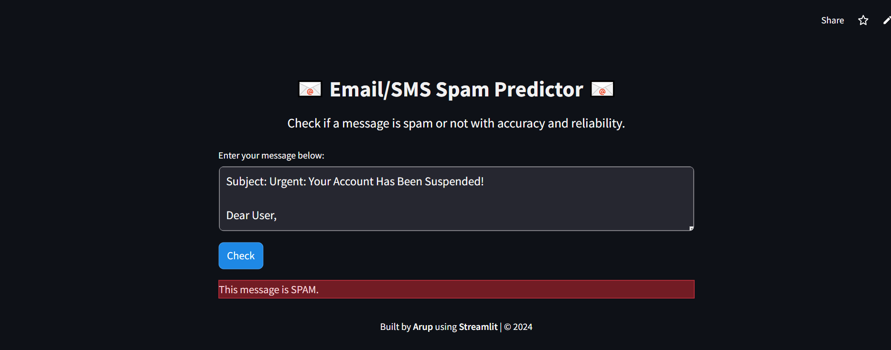

# 📧 Email/SMS Spam Predictor 📧

A web-based application that predicts whether a given email or SMS message is **HAM (Not Spam)** or **SPAM** using **Naive Bayes Classifier**, **Natural Language Processing (NLP)** techniques, and a sleek interface built with **Streamlit**.

---

## Live Link

https://email-spam-peycvgxri3ambvss4mhyni.streamlit.app/

---

## 🌟 Features

- **NLP Pipeline**: Preprocessing using tokenization, stop-word removal, stemming, and vectorization with TF-IDF.
- **Machine Learning Model**: Naive Bayes Classifier trained on labeled datasets for accurate predictions.
- **Interactive UI**: Developed with Streamlit, styled using custom HTML and CSS, and supports both light and dark browser themes.
- **Web-based Solution**: No installation required for the online version.

---

## 🚀 How It Works

1. Enter the text of the email or SMS in the input box.
2. Click the **Check** button.
3. The app processes the input, transforms it using NLP techniques, and predicts whether the message is spam or not.
4. Results are displayed instantly with professional color-coded labels.

---

## 🛠️ Tech Stack

- **Natural Language Processing (NLP)**:
  - Tokenization
  - Stop-word removal
  - Stemming with PorterStemmer
  - TF-IDF Vectorization
- **Machine Learning**:
  - Naive Bayes Classifier
- **Frontend**:
  - Streamlit
  - Custom HTML and CSS for professional UI
- **Backend**:
  - Python
  - Pickle for model serialization

---

## ⚙️ Manual Installation Guide

Follow these steps to set up the project on your local system:

### Prerequisites

- Python 3.8 or higher
- pip (Python package manager)
- Virtual environment (recommended)

### Installation Steps

1. **Clone the repository**:
   ```bash
   git clone 
   cd email-sms-spam-predictor

2. **Set up a virtual environment**:
    ```bash
    python -m venv env
    source env/bin/activate  # On Windows, use `env\Scripts\activate`

3. **Install dependencies**:
    ```bash
    pip install -r requirements.txt

4. **Run the Streamlit application**:
    ```bash
    streamlit run app.py

5. **Access the app locally**:
    - Open your browser and navigate to: http://localhost:8501

---

## 💻Output

- **Spam message**


- **Ham message**

